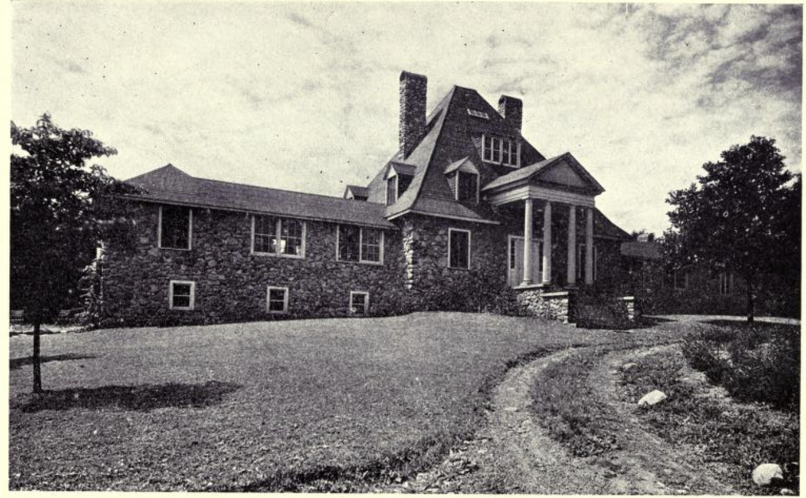

# Shelter

For many years, shelter for us had meant the four walls of an apartment in New York City with all the conveniences and services which were included in the rent we paid. We took electricity and gas, running hot and cold water, steam heat and modern plumbing, and janitor service, quite for granted. It is true that a few years before our flight from the city we had moved into a house in Flushing, a half-hour from the center of the city. We then made the discovery that it was possible for us to run a house and that we could have much more room, for the same rent, if we were willing to burden ourselves with the responsibility for producing our own hot water and our own heat in the winter. This experience helped to get us into a frame of mind in which we could seriously consider living in a house in the country in which there were none of the comforts to which we were accustomed, until we installed them and maintained them for ourselves. The purchase of a home in which they were already present was out of question because our funds were too small, and besides, that would have reduced the field in which we might experiment with building and making things for ourselves.

The house on the place which we purchased when we moved to the country twelve years ago--our present home is not on the same place--was in part very old. Hewn timbers, fitted together with wooden pins, had been used in the construction of one part of the building. The newer section must have been added many years later, since the timbers were regulation stuff. In addition, this new section must have at one time been a separate building, because the ceilings in the two sections were of different heights with the floor levels of the second story varying correspondingly. The entrance was at one side of the house and the front door decorated with a stupid little porch. Study of the lines of the building led us to the conclusion that the door would have to be shifted to the center and the window in the center moved to where the door was. The front porch, we decided, was an anachronism which had no place in our picture of the sort of house we wanted. At the back was a door which for some unknown reason opened into the thin air with a sheer drop of three feet to the ground. There were partitions inside where openings should have been, and doors had been cut where there should have been solid walls.

There was no electricity, no gas, no bathroom, no heating system. There wasn't even a fireplace, something for which we had romantically hungered. The only thing approaching a convenience was an old-fashioned hand suction pump in the kitchen connected to an iron sink. But we found out that it didn't work, and besides, that it was connected to a cistern in which there was rarely any water.

To make this house over into what would furnish us the equivalent of the comforts to which we were accustomed would have required the employment of carpenters, of joiners, of plasterers, of plumbers, of steam-fitters, of electricians.

To us these necessary alterations loomed up portentously. If the house was to be made livable, all of them would have to be made, and since we lacked the means to employ contractors to make all of them for us, there was only one way out of the dilemma, and that was to undertake to make most of them myself. An initial experience with contractors helped to strengthen our determination in this direction. We had purchased an electric range--price $75--for use in the country. We made arrangements with an electrician to install the range the day after we arrived, and received a bill for $35 for the work--nearly half the cost of the range. Whether the charge was exorbitant or not, it seemed to us high, and to me it did not seem to involve much in the way of skills which I could not master.

I began to accumulate tools from that moment, and decided to train myself for the job of jack-of-all-trades by undertaking to build something on which my 'prentice hand could do no irretrievable damage. A new chicken-house was elected. The shanty we had found on the place, and which had been used for a chicken-house, was such a dirty, hopelessly inefficient mess that it had to be torn down. With what could be retrieved from the lumber in the old chicken-house and a few new two-by-fours and boards, I began to build a chicken-house.

The building of that chicken-house proved a liberal education. If it did not make me into a finished carpenter, it at least gave me the courage to undertake the remodeling of the house, and eventually make it over to something nearer to our idea of what a modest country home should look like.

In the course of the year during which I spent all my spare hours remodeling the house, building in cupboards and closets and furniture, putting in electric lights, installing an automatic pumping system, I acquired a wholesome confidence in my ability to work with tools. I learned that deficiencies of experience and skill could be offset by the time and pains put into each job. Before I was through with my building operations on "Sevenacres," I came to the conclusion that most of the work which we think only skilled mechanics can do is quite within the capacities of any intelligent and persevering man. While some of the work which they do, and certainly the speed with which they can work, requires years of experience, most of their skills involve relatively simple techniques. The mysterious knowledge which makes the average city man, in his ignorance, telephone for an electrician whenever a fuse blows out or an electric-light fixture fails to function, and to hunt for the janitor or call for a plumber when a faucet leaks, hasn't the right to be mysterious to anyone over the age of fifteen.

The effort to produce shelter for ourselves in this way produced a number of dividends upon which we had not counted in the beginning. We, of course, counted most upon reducing the cost of shelter. In the city, a full quarter of our income had been spent for rent. By owning our home, and above all by making our investment small because we were willing to put some of our own labor into rebuilding, we cut down the cost of shelter to not much more than I earned by one or two days' work a month. That left just so much more of what we used to spend for rent available for other purposes than shelter; we had the income for from four to five days more each month to save or spend.

One of the dividends upon which we had not counted was that of health. We found that this sort of work, if it was not overdone (of which there is a real danger when one's enthusiasm is great), furnishes wholesome and necessary exercise. And instead of being just the mechanical exercise of gymnasium work, it is exercise for the intellect and the emotions as well.

Another dividend was the discovery that building could be fun. Slowly but surely the things we conceived first as an idea finally became realities embodied in sticks and stones. The space where we decided that a cupboard was needed was eventually occupied by one, and the cupboard we dreamed and designed on a piece of paper eventually grew into a real cupboard which served a functional purpose in our lives. The satisfaction of standing off and looking at it when the last stroke of the paint-brush had been laid upon it was emotionally much the same thing felt by an artist when surveying a painting which he had finally finished. The creative artist and the creative carpenter are brothers under the skin. Creating and making things has its pains, no doubt, but it has pleasures so great that they offset the pains.

One dividend upon which we had not counted was the discovery that the right kind of machines often made up for the lack of skill--and the lack of strength--of an inexperienced craftsman such as myself. A concrete-mixer can furnish the strength for mixing sand and stone and cement to a man who ordinarily never does any work heavier than shoving a pen across the papers on a desk. And an electric saw can furnish him the skill to make a square and plumb cut on a rafter which he might never be able to acquire with a hand saw.

Out of this discovery grew our workshop, equipped with all sorts of power-driven machines which furnished skill, supplied strength, and saved labor. In spite of the fact that in my case I had to start with zero in the way of experience in buying tools and machines, most of the purchases made for the shop have proved to be paying investments. I use the term workshop symbolically rather than geographically, for many kinds of work are done and many of our tools are kept outside of the workshop itself. Our shop now includes equipment for building with stone and cement, for carpentry, for plumbing and steam-fitting, for electrical wiring, for painting, and for heavier work such as hauling, grading and excavating, pulling stumps, and even blasting. We ought to have, but haven't as yet, a forge and a lathe. When we install these machines for metal-working we shall be able to do almost any job which may develop in connection with the running and development of our homestead.

This equipment wasn't all purchased at once. It was acquired piece by piece as necessity dictated and as our purse permitted. I never, however, hesitated to buy a piece of machinery on credit or installments if I felt confident that it would pay for itself eventually out of its savings. The concrete-mixer, for instance, was purchased when we decided to build our new home of stone instead of wood. It has been used not only to build one house, but four houses, and the last considerable job for which it was used was the mixing of the concrete for our swimming-pool. This was built almost wholely by our two boys, and but for this piece of machinery and the tractor and scraper used in excavating the ground, it would have been an impossible task for them. The mixer has paid for itself over and over again, and it still stands, old and battered, it is true, but ready for the same sort of service it has furnished us in the past.

Another piece of machinery which served in many different ways was a combination circular saw, planing-machine, and drill. These combination machines are, on the basis of my experience, a mistake. Separate machines are better in the long run, even though the investment in them is somewhat greater. We have used the drill on this combination hardly at all, and a separate band saw and separate planing-machine would be better than the machine which we purchased. The band saw can handle heavy timber as well as ordinary lumber, timbers for which the circular saw is too small. Nevertheless we have used our saw machine on many jobs, though it is now relegated mainly to the job of cutting wood for our fireplaces and kitchen stove. Recently we managed to rig up an attachment which enabled us to use a much larger saw on this machine, and we have discovered that it is possible for us to rip boards up to six inches in width out of logs grown in our own wood lot. In our section of the country the blight has killed all the chestnut trees, and we have quantities of this fine hardwood which we were burning until it occurred to me that we might use this chestnut for making furniture. By this coming winter we shall have accumulated a quantity of chestnut lumber and shall then turn in earnest to furniture-making.

Our circular-saw machine was supplemented after a time with an electric hand saw--one of the most useful tools on our place. It has proved not only a great time and muscle saver, but has added immensely to the skill of everyone who has used it. It takes a skilled carpenter to make a perfectly square cut with a hand saw. The electric saw makes it possible for any handy man to do an extremely workman-like job. And of course when it comes to ripping boards, the speed with which it does the work delights the heart.

An equally useful tool has been our electric hand drill. It has, for one thing, almost relegated the brace and bit to limbo. We never use so slow a tool except for holes too large for our electric drill. We use this tool not only for drilling in wood and iron, but also for reaming pipes, and sometimes for sharpening tools. We have other machines which are not quite so often used--a sander, and a paint-machine, for example. As all our houses are built of stone, we do not have much painting of large surfaces with which to bother, so we have not the need of a painting-machine which those who build of wood would have. Taking them as a whole, these machines have made it possible for us to build up our place steadily, and to add improvements during odd times which would otherwise be wasted. It is largely because of these machines that we have built four stone houses on our places--three residences and a stone barn.

Our determination to build in stone dates back to discovery of Ernest Flagg's experiments in the building of attractive and economical small houses. Flagg developed a system of building out of stone and concrete, using forms in which to lay the walls, which greatly reduced the cost of stone construction. Relatively unskilled labor could build Flagg walls which were attractive, which were sound, and which were true. As a result, we found ourselves building of stone--the natural building material for a county with the name Rockland--at a cost not much higher than that of good frame construction.

My enthusiasm for many of Flagg's ideas has not abated. For instance, he calls attention to the absurdity of cellars under houses built in the country. The cellar usually represents a fifth of the cost of the house. For much less money, the storage space ordinarily furnished by a cellar can be provided by adding to the area of the building. Except where the contour of the ground calls for a basement or cellar, all our houses are built on what are virtually concrete platforms, over which the regular floors have been laid.

Another idea of his has been the building of one-story houses, without attics and with low walls, using dormers over doors and windows to secure height where height is needed. This makes it possible to build outside stone walls which are not more than four or five feet in height for the most part, so that stone and concrete do not have to be carried up to a considerable height and scaffolds erected on which to work. The use of what he calls ridge dormers or ridge skylights makes it easy to ventilate these one-story houses in summer.

But one of the things most attractive to me in Flagg's type of construction is the number of designs which can be built around courts, section by section. This makes it possible to build a part of a house to begin with, and add to it as means permit. When we started to build our main house on the new place, we first finished one wing of the house, and lived in it until the main part was finished. That took us over a year. The whole house is not even now finished--nor do I see any reason why it should ever be. A home, it seems to me, should grow like the human beings it shelters. Building one's shelter in this way, section by section, made it much easier for us to finance the building of the sort of home to which we aspired. And it should make it very much easier for those who have not enough money at the beginning for all the home that their vision paints for them.
