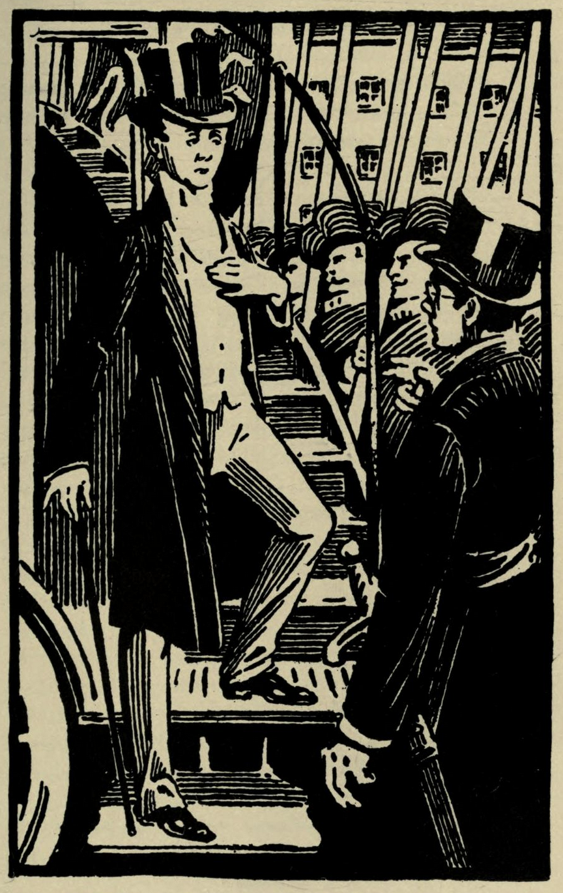

# The Correspondent of "The Court Journal"

Journalism had become like most other such things in England, under the cautious government and philosophy represented by James Barker, somewhat sleepy and much diminished in importance. This was partly due to the disappearance of party government and public speaking, partly to the compromise or dead-lock which had made foreign wars impossible, but mostly, of course, to the temper of the whole nation, which was that of a people in a kind of back-water. Perhaps the most well-known of the remaining newspapers was the *Court Journal*, which was published in a dusty but genteel-looking office just out of Kensington High Street. For when all the papers of a people have been for years growing more and more dim and decorous and optimistic, the dimmest and most decorous and most optimistic is very likely to win. In the journalistic competition which was still going on at the beginning of the twentieth century, the final victor was the *Court Journal*.

For some mysterious reason the King had a great affection for hanging about in the *Court Journal* office, smoking a morning cigarette and looking over files. Like all ingrainedly idle men, he was very fond of lounging and chatting in places where other people were doing work. But one would have thought that, even in the prosaic England of his day, he might have found a more bustling centre.

On this particular morning, however, he came out of Kensington Palace with a more alert step and a busier air than usual. He wore an extravagantly long frock-coat, a pale-green waistcoat, a very full and *dégagé* black tie, and curious yellow gloves. This was his uniform as Colonel of a regiment of his own creation, the ist Decadents Green. It was a beautiful sight to see him drilling them. He walked quickly across the Park and the High Street, lighting his cigarette as he went, and flung open the door of the Court Journal office.

"You've heard the news, Pally---you've heard the news?" he said.

The Editor's name was Hoskins, but the King called him Pally, which was an abbreviation of Palladium of our Liberties.

"Well, your Majesty," said Hoskins, slowly (he was a worried, gentlemanly looking person, with a wandering brown beard)--"well, your Majesty, I have heard rather curious things, but I--"

"You'll hear more of them," said the King, dancing a few steps of a kind of negro shuffle. "You'll hear more of them, my blood-and-thunder tribune. Do you know what I am going to do for you?"

"No, your Majesty," replied the Palladium, vaguely.

"I'm going to put your paper on strong, dashing, enterprising lines," said the King. "Now, where are your posters of last night's defeat?"

"I did not propose, your Majesty," said the Editor, "to have any posters exactly--"

"Paper, paper!" cried the King, wildly; "bring me paper as big as a house. I'll do you posters. Stop, I must take my coat off." He began removing that garment with an air of set intensity, flung it playfully at Mr. Hoskins' head, entirely enveloping him, and looked at himself in the glass. "The coat off," he said, "and hat on. That looks like a sub-editor. It is indeed the very essence of sub-editing. Well," he continued, turning round abruptly, "come along with that paper."

The Palladium had only just extricated himself reverently from the folds of the King's frock-coat, and said bewildered--

"I am afraid, your Majesty--"

"Oh, you've got no enterprise," said Auberon. "What's that roll in the corner? Wall-paper? Decorations for your private residence? Art in the home, Pally? Fling it over here, and I'll paint such posters on the back of it that when you put it up in your drawing-room you'll paste the original pattern against the wall." And the King unrolled the wall-paper, spreading it over the whole floor. "Now give me the scissors," he cried, and took them himself before the other could stir.

He slit the paper into about five pieces, each nearly as big as a door. Then he took a big blue pencil and went down on his knees on the dusty oil-cloth, and began to write on them, in huge letters--

> FROM THE FRONT.
>
> GENERAL BUCK DEFEATED.
>
> DARKNESS, DANGER, AND DEATH.
>
> WAYNE SAID TO BE IN PUMP STREET.
>
> FEELING IN THE CITY.

He contemplated it for some time, wkh his head on one side, and got up, with a sigh.

"Not quite intense enough," he said--"not alarming. I want the *Court Journal* to be feared as well as loved. Let's try something more hard-hitting." And he went down on his knees again. After sucking the blue pencil for some time, he began writing again busily. "How will this do?" he said--

> WAYNE'S WONDERFUL VICTORY.

"I suppose," he said, looking up appealingly, and sucking the pencil--"I suppose we couldn't say 'wictory'--'Wayne's wonderful wictory'? No, no. Refinement, Pally, refinement. I have it."

> WAYNE WINS.
>
> ASTOUNDING FIGHT IN THE DARK.
>
> *The gas-lamps in their courses, fought against Buck*.

"(Nothing like our fine old English translation.) What else can we say? Well, anything to annoy old Buck;" and he added, thoughtfully, in smaller letters--

> Rumoured Court-martial on General Buck.

"Those will do for the present," he said, and turned them both face downwards. "Paste, please."

The Palladium, with an air of great terror, brought the paste out of an inner room.

The King slabbed it on with the enjoyment of a child messing with treacle. Then taking one of his huge compositions fluttering in each hand, he ran outside, and began pasting them up in prominent positions over the front of the office.

"And now," said Auberon, entering again with undiminished vivacity--"now for the leading article."

He picked up another of the large strips of wall-paper, and, laying it across a desk, pulled out a fountain-pen and began writing with feverish intensity, reading clauses and fragments aloud to himself, and rolling them on his tongue like wine, to see if they had the pure journalistic flavour.

"The news of the disaster to our forces in Notting Hill, awful as it is, awful as it is--(no, distressing as it is), may do some good if it draws attention to the what's-his-name inefficiency (scandalous inefficiency, of course) of the Government's preparations. In our present state of information, it would be premature (what a jolly word!)--it would be premature to cast any reflections upon the conduct of General Buck, whose services upon so many stricken fields (ha, ha!), and whose honourable scars and laurels, give him a right to have judgment upon him at least suspended. But there is one matter on which we must speak plainly. We have been silent on it too long, from feelings, perhaps of mistaken caution, perhaps of mistaken loyalty. This situation would never have arisen but for what we can only call the indefensible conduct of the King. It pains us to say such things, but, speaking as we do in the public interests (I plagiarise from Barker's famous epigram), we shall not shrink because of the distress we may cause to any individual, even the most exalted. At this crucial moment of our country, the voice of the People demands with a single tongue, 'Where is the King?' What is he doing while his subjects tear each other in pieces in the streets of a great city? Are his amusements and his dissipations (of which we cannot pretend to be ignorant) so engrossing that he can spare no thought for a perishing nation? It is with a deep sense of our responsibility that we warn that exalted person that neither his great position nor his incomparable talents will save him in the hour of delirium from the fate of all those who, in the madness of luxury or tyranny, have met the English people in the rare day of its wrath."

"I am now," said the King, "going to write an account of the battle by an eye-witness." And he picked up a fourth sheet of wall-paper. Almost at the same moment Buck strode quickly into the office. He had a bandage round his head.

"I was told," he said with his usual gruff civility, "that your Majesty was here."

"And of all things on earth," cried the King, with delight, "here is an eye-witness! An eye-witness who, I regret to observe, has at present only one eye to witness with. Can you write us the special article, Buck? Have you a rich style?"

Buck, with a self-restraint which almost approached politeness, took no notice whatever of the King's maddening geniality.

"I took the liberty, your Majesty," he said shortly, "of asking Mr. Barker to come here also."

As he spoke, indeed, Barker came swinging into the office, with his usual air of hurry.

"What is happening now?" asked Buck, turning to him with a kind of relief.

"Fighting still going on," said Barker. "The four hundred from West Kensington were hardly touched last night. They hardly got near the place. Poor Wilson's Bayswater men got cut about, though. They fought confoundedly well. They took Pump Street once. What mad things do happen in the world. To think that of all of us it should be little Wilson with the red whiskers who came out best."

The King made a note on his paper--

> *"Romantic Conduct of Mr. Wilson."*

"Yes," said Buck, "it makes one a bit less proud of one's 'h's.'"

The King suddenly folded or crumpled up the paper, and put it in his pocket.

"I have an idea," he said. "I will be an eye-witness. I will write you such letters from the Front as will be more gorgeous than the real thing. Give me my coat, Palladium. I entered this room a mere King of England. I leave it, Special War Correspondent of the *Court Journal*. It is useless to stop me, Pally; it is vain to cling to my knees, Buck; it is hopeless, Barker, to weep upon my neck. 'When duty calls'--the remainder of the sentiment escapes me. You will receive my first article this evening by the eight o'clock post."

And, running out of the office, he jumped upon a blue Bayswater omnibus that went swinging by.

"Well," said Barker, gloomily, "well."

"Barker," said Buck, "business may be lower than politics, but war is, as I discovered last night, a long sight more like business. You politicians are such ingrained demagogues that even when you have a despotism you think of nothing but public opinion. So you learn to tack and run, and are afraid of the first breeze. Now we stick to a thing and get it. And our mistakes help us. Look here! at this moment we've beaten Wayne."

"Beaten Wayne," repeated Barker.

"Why the dickens not?" cried the other, flinging out his hands. "Look here. I said last night that we had them by holding the nine entrances. Well, I was wrong. We should have had them but for a singular event the lamps went out. But for that it was certain. Has it occurred to you, my brilliant Barker, that another singular event has happened since that singular event of the lamps going out?"

"What event?" asked Barker.

"By an astounding coincidence, the sun has risen," cried out Buck, with a savage air of patience. "Why the hell aren't we holding all those approaches now, and passing in on them again? It should have been done at sunrise. The confounded doctor wouldn't let me go out. You were in command."

Barker smiled grimly.

"It is a gratification to me, my dear Buck, to be able to say that we anticipated your suggestions precisely. We went as early as possible to reconnoitre the nine entrances. Unfortunately, while we were fighting each other in the dark, like a lot of drunken navvies, Mr. Wayne's friends were working very hard indeed. Three hundred yards from Pump Street, at every one of those entrances, there is a barricade nearly as high as the houses. They were finishing the last, in Pembridge Road, when we arrived. Our mistakes," he cried bitterly, and flung his cigarette on the ground. "It is not we who learn from them."

There was a silence for a few moments, and Barker lay back wearily in a chair. The office clock ticked exactly in the stillness.

At length Barker said suddenly--

"Buck, does it ever cross your mind what this is all about? The Hammersmith to Maida Vale thoroughfare was an uncommonly good speculation. You and I hoped a great deal from it. But is it worth it? It will cost us thousands to crush this ridiculous riot. Suppose we let it alone?"

"And be thrashed in public by a red-haired madman whom any two doctors would lock up?" cried out Buck, starting to his feet. "What do you propose to do, Mr. Barker? To apologise to the admirable Mr. Wayne? To kneel to the Charter of the Cities? To clasp to your bosom the flag of the Red Lion? To kiss in succession every sacred lamp-post that saved Netting Hill? No, by God! My men fought jolly well they were beaten by a trick. And they'll fight again."

"Buck," said Barker, "I always admired you. And you were quite right in what you said the other day."

"In what?"

"In saying," said Barker, rising quietly, "that we had all got into Adam Wayne's atmosphere and out of our own. My friend, the whole territorial kingdom of Adam Wayne extends to about nine streets, with barricades at the end of them. But the spiritual kingdom of Adam Wayne extends, God knows where---it extends to this office at any rate. The red-haired madman whom any two doctors would lock up is filling this room with his roaring, unreasonable soul. And it was the red-haired madman who said the last word you spoke."

Buck walked to the window without replying. "You understand, of course," he said at last, "I do not dream of giving in."

The King, meanwhile, was rattling along on the top of his blue omnibus. The traffic of London as a whole had not, of course, been greatly disturbed by these events, for, the affair was treated as a Netting Hill riot, and that area was marked off as if it had been in the hands of a gang of recognised rioters. The blue omnibuses simply went round as they would have done if a road were being mended, and the omnibus on which the correspondent of the *Court Journal* was sitting swept round the corner of Queen's Road, Bayswater.

The King was alone on the top of the vehicle, and was enjoying the speed at which it was going.

"Forward, my beauty, my Arab," he said, patting the omnibus encouragingly, "fleetest of all thy bounding tribe. Are thy relations with thy driver, I wonder, those of the Bedouin and his steed? Does he sleep side by side with thee--"

His meditations were broken by a sudden and jarring stoppage. Looking over the edge, he saw that the heads of the horses were being held by men in the uniform of Wayne's army, and heard the voice of an officer calling out orders.

King Auberon descended from the omnibus with dignity. The guard or picket of red halberdiers who had stopped the vehicle did not number more than twenty, and they were under the command of a short, dark, clever-looking young man, conspicuous among the rest as being clad in an ordinary frock-coat, but girt round the waist with a red sash and a long seventeenth-century sword. A shiny silk hat and spectacles completed the outfit in a pleasing manner.

"To whom have I the honour of speaking?" said the King, endeavouring to look like Charles I, in spite of personal difficulties.

The dark man in spectacles lifted his hat with equal gravity.

"My name is Bowles," he said. "I am a chemist. I am also a captain of O company of the army of Notting Hill. I am distressed at having to incommode you by stopping the omnibus, but this area is covered by our proclamation, and we intercept all traffic. May I ask to whom I have the honour---Why, good gracious, I beg your Majesty's pardon. I am quite overwhelmed at finding myself concerned with the King."

Auberon put up his hands with indescribable grandeur.

"Not with the King," he said; "with the special war correspondent of the *Court Journal*."

"I beg your Majesty's pardon," began Mr. Bowles, doubtfully.

"Do you call me Majesty? I repeat," said Auberon firmly, "I am a representative of the press. I have chosen, with a deep sense of responsibility, the name of Pinker. I should desire a veil to be drawn over the past."

"Very well, sir," said Mr. Bowles, with an air of submission, "in our eyes the sanctity of the press is at least as great as that of the throne. We desire nothing better than that our wrongs and our glories should be widely known. May I ask, Mr. Pinker, if you have any objection to being presented to the Provost and to General Turnbull?"

"The Provost I have had the honour of meeting," said Auberon, easily. "We old journalists, you know, meet everybody. I should be most delighted to have the same honour again. General Turnbull, also, it would be a gratification to know. The younger men are so interesting. We of the old Fleet Street gang lose touch with them."

"Will you be so good as to step this way?" said the leader of O company.

"I am always good," said Mr. Pinker. "Lead on."
