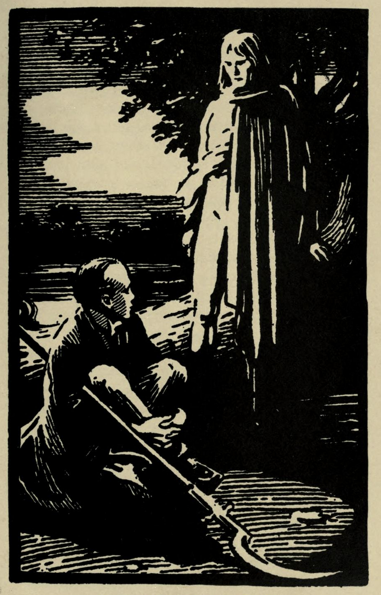

# Two Voices

In a place in which there was total darkness for hours, there was also for hours total silence. Then a voice spoke out of the darkness, no one could have told from where, and said aloud--

"So ends the Empire of Notting Hill As it began in blood, so it ended in blood, and all things are always the same."

And there was silence again, and then again there was a voice, but it had not the same tone; it seemed that it was not the same voice.

"If all things are always the same, it is because they are always heroic. If all things are always the same, it is because they are always new. To each man one soul only is given; to each soul only is given a little power---the power at some moments to outgrow and swallow up the stars. If age after age that power comes upon men, whatever gives it to them is great. Whatever makes men feel old is mean---an empire or a skin-flint shop. Whatever makes men feel young is great---a great war or a love story. And in the darkest of the books of God there is written a truth that is also a riddle. It is of the new things that men tire---of fashions and proposals and improvements and change. It is the old things that startle and intoxicate. It is the old things that are young. There is no sceptic who does not feel that many have doubted before. There is no rich and fickle man who does not feel that all his novelties are ancient. There is no worshipper of change who does not feel upon his neck the vast weight of the weariness of the universe. But we who do the old things are fed by nature with a perpetual infancy. No man who is in love thinks that any one has been in love before. No woman who has a child thinks that there have been such things as children. No people that fight for their own city are haunted with the burden of the broken empires. Yes, oh dark voice, the world is always the same, for it is always unexpected."

A little gust of wind blew through the night, and then the first voice answered--

"But in this world there are some, be they wise or foolish, whom nothing intoxicates. There are some who see all your disturbances like a cloud of flies. They know that while men will laugh at your Notting Hill, and will study and rehearse and sing of Athens and Jerusalem, Athens and Jerusalem were silly suburbs like your Notting Hill. They know that the earth itself is a suburb, and can feel only drearily and respectably amused as they move upon it."

"They are philosophers or they are fools," said the other voice. "They are not men. Men live, as I say, rejoicing from age to age in something fresher than progress---in the fact that with every baby a new sun and a new moon are made. If our ancient humanity were a single man, it might perhaps be that he would break down under the memory of so many loyalties, under the burden of so many diverse heroisms, under the load and terror of all the goodness of men. But it has pleased God so to isolate the individual soul that it can only learn of all other souls by hearsay, and to each one goodness and happiness come with the youth and violence of lightning, as momentary and as pure. And the doom of failure that lies on all human systems does not in real fact affect them any more than the worms of the inevitable grave affect a children's game in a meadow. Notting Hill has fallen; Notting Hill has died. But that is not the tremendous issue. Notting Hill has lived."

"But if," answered the other voice, "if what is achieved by all these efforts be only the common contentment of humanity, why do men so extravagantly toil and die in them? Has nothing been done by Netting Hill that any chance clump of farmers or clan of savages would not have done without it? What might have been done to Notting Hill if the world had been different may be a deep question; but there is a deeper. What could have happened to the world if Notting Hill had never been?"

The other voice replied--

"The same that would have happened to the world and all the starry systems if an apple-tree grew six apples instead of seven; something would have been eternally lost. There has never been anything in the world absolutely like Notting Hill. There will never be anything quite like it to the crack of doom. I cannot believe anything but that God loved it as He must surely love anything that is itself and unreplaceable. But even for that I do not care. If God, with all His thunders, hated it, I loved it."

And with the voice a tall, strange figure lifted itself out of the debris in the half-darkness.

The other voice came after a long pause, and as it were hoarsely.

"But suppose the whole matter were really a hocus-pocus. Suppose that whatever meaning you may choose in your fancy to give to it, the real meaning of the whole was mockery. Suppose it was all folly. Suppose--"

"I have been in it," answered the voice from the tall and strange figure, "and I know it was not."

A smaller figure seemed half to rise in the dark.

"Suppose I am God," said the voice, "and suppose I made the world in idleness. Suppose the stars, that you think eternal, are only the idiot fireworks of an everlasting schoolboy. Suppose the sun and the moon, to which you sing alternately, are only the two eyes of one vast and sneering giant, opened alternately in a never-ending wink. Suppose the trees, in my eyes, are as foolish as enormous toad-stools. Suppose Socrates and Charlemagne are to me only beasts, made funnier by walking on their hind legs. Suppose I am God, and having made things, laugh at them."

"And suppose I am man," answered the other. "And suppose that I give the answer that shatters even a laugh. Suppose I do not laugh back at you, do not blaspheme you, do not curse you. But suppose, standing up straight under the sky, with every power of my being, I thank you for the fools' paradise you have made. Suppose I praise you, with a literal pain of ecstasy, for the jest that has brought me so terrible a joy. If we have taken the child's games, and given them the seriousness of a Crusade, if we have drenched your grotesque Dutch garden with the blood of martyrs, we have turned a nursery into a temple. I ask you, in the name of Heaven, who wins?"

The sky close about the crest of the hills and trees was beginning to turn from black to grey, with a random suggestion of the morning. The slight figure seemed to crawl towards the larger one, and the voice was more human.

"But suppose, friend," it said, "suppose that, in a bitterer and more real sense, it was all a mockery. Suppose that there had been, from the beginning of these great wars, one who watched them with a sense that is beyond expression, a sense of detachment, of responsibility, of irony, of agony. Suppose that there were one who knew it was all a joke."

The tall figure answered--

"He could not know it. For it was not all a joke."

And a gust of wind blew away some clouds that sealed the sky-line, and showed a strip of silver behind his great dark legs. Then the other voice came, having crept nearer still.

"Adam Wayne," it said, "there are men who confess only in *articulo mortis*; there are people who blame themselves only when they can no longer help others. I am one of them. Here, upon the field of the bloody end of it all, I come to tell you plainly what you would never understand before. Do you know who I am?"

"I know you, Auberon Quin," answered the tall figure, "and I shall be glad to unburden your spirit of anything that lies upon it."

"Adam Wayne," said the other voice, "of what I have to say you cannot in common reason be glad to unburden me. Wayne, it was all a joke. When I made these cities, I cared no more for them than I care for a centaur, or a merman, or a fish with legs, or a pig with feathers, or any other absurdity. When I spoke to you solemnly and encouragingly about the flag of your freedom and the peace of your city, I was playing a vulgar practical joke on an honest gentleman, a vulgar practical joke that has lasted for twenty years. Though no one could believe ft of me perhaps, it is the truth that I am a man both timid and tender-hearted. I never dared in the early days of your hope, or the central days of your supremacy, to tell you this; I never dared to break the colossal calm of your face. God knows why I should do it now, when my farce has ended in tragedy and the ruin of all your people! But I say it now. Wayne, it was done as a joke."

There was silence, and the freshening breeze blew the sky clearer and clearer, leaving great spaces of the white dawn.

At last Wayne said, very slowly--

"You did it all only as a joke?"

"Yes," said Quin.

"When you conceived the idea," went on Wayne, dreamily, "of an army for Bayswater and a flag for Notting Hill, there was no gleam, no suggestion in your mind that such things might be real and passionate?"

"No," answered Auberon, turning his round, white face to the morning with a dull and splendid sincerity; "I had none at all."

Wayne sprang down from the height above him and held out his hand.

"I will not stop to thank you," he said, with a curious joy in his voice, "for the great good for the world you have actually wrought. All that I think of that I have said to you a moment ago, even when I thought that your voice was the voice of a derisive omnipotence, its laughter older than the winds of heaven. But let me say what is immediate and true. You and I, Auberon Quin, have both of us throughout our lives been again and again called mad. And we are mad. We are mad, because we are not two men but one man. We are mad, because we are two lobes of the same brain, and that brain has been cloven in two. And if you ask for the proof of it, it is not hard to find. It is not merely that you, the humorist, have been in these dark days stripped of the joy of gravity. It is not merely that I, the fanatic, have had to grope without humour. It is that though we seem to be opposite in everything, we have been opposite like man and woman, aiming at the same moment at the same practical thing. We are the father and the mother of the Charter of the Cities."

Quin looked down at the debris of leaves and timber, the relics of the battle and stampede, now glistening in the glowing daylight, and finally said--

"Yet nothing can alter the antagonism---the fact that I laughed at these things and you adored them."

Wayne's wild face flamed with something god-like, as he turned it to be struck by the sunrise.

"I know of something that will alter that antagonism, something that is outside us, something that you and I have all our lives perhaps taken too little account of. The equal and eternal human being will alter that antagonism, for the human being sees no real antagonism between laughter and respect, the human being, the common man, whom mere geniuses like you and me can only worship like a god. When dark and dreary days come, you and I are necessary, the pure fanatic, the pure satirist. We have between us remedied a great wrong. We have lifted the modern cities into that poetry which every one who knows mankind knows to be immeasurably more common than the commonplace. But in healthy people there is no war between us. We are but the two lobes of the brain of a ploughman. Laughter and love are everywhere. The cathedrals, built in the ages that loved God, are full of blasphemous grotesques. The mother laughs continually at the child, the lover laughs continually at the lover, the wife at the husband, the friend at the friend. Auberon Quin, we have been too long separated; let us go out together. You have a halberd and I a sword, let us start our wanderings over the world. For we are its two essentials. Come, it is already day."

In the blank white light Auberon hesitated a moment. Then he made the formal salute with his halberd, and they went away together into the unknown world.

**The End.**
